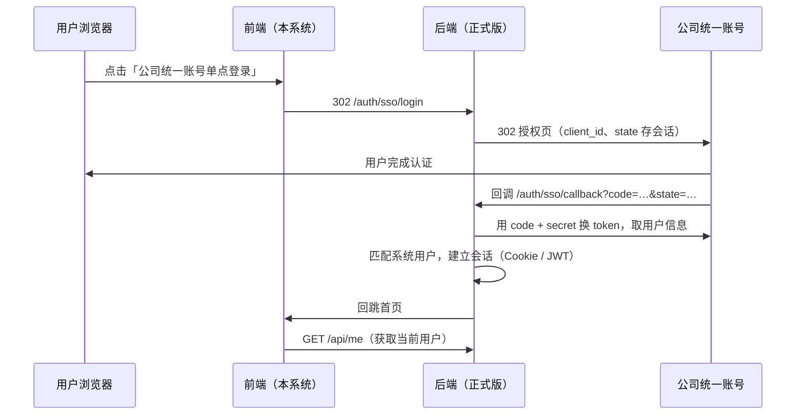

# 公司统一账号单点登录（SSO）接入说明

> 版本：演示版 v0.6 ｜ 2026-09-11

## 1. 目标

本系统与公司统一账号打通单点登录：用户在 E办 中完成身份认证后，免密进入「部门工作任务看板」，无需单独账号密码。

## 2. 演示版已具备的能力

- **登录页「公司统一账号单点登录」入口**
  - 未配置接入参数：**演示模式** —— 弹出对话框模拟一次「授权回调」，选择身份后完成登录（演示用）
  - 已配置参数：点击即**真实跳转** E办 授权页（OAuth2 授权码模式），认证完成免密返回
- **回调页 `/#/sso-callback`**：校验 state → 用 code 换取用户信息 → 匹配系统账号 → 免密登录
  - 兼容两种回调形式：`#/sso-callback?code=…`（hash 内）与 `/?code=…&#/sso-callback`（hash 前）
- **「设置 → 单点登录」配置面板**（管理员）：授权地址 / clientId / 用户信息接口 / 回调地址 / 账号字段，本机浏览器保存，便于提前演练
- **账号匹配规则**：优先按账号（`account` 字段与E办账号 / 工号一致，忽略大小写） → 其次按姓名
- **环境变量默认值**（构建时注入，可被本机配置覆盖）：
  `VITE_SSO_AUTH_URL`、`VITE_SSO_CLIENT_ID`、`VITE_SSO_USERINFO_URL`、`VITE_SSO_REDIRECT_URI`、`VITE_SSO_ACCOUNT_FIELD`、`VITE_SSO_SCOPE`

## 3. 需要向 IT / E办 申请或确认的信息（对接清单）

| 类别 | 需要的信息 |
| --- | --- |
| 协议 | 是否标准 OAuth2 授权码模式；是否需要 scope；state / 签名要求 |
| 端点 | ① 授权端点（authorize）② 令牌端点（token，后端用）③ 用户信息端点（userinfo / 工号查询） |
| 凭证 | clientId（appId）、clientSecret（**仅后端使用，禁止下发前端**） |
| 回调 | 允许的 redirect_uri 白名单；是否要求 HTTPS / 指定域名 / 备案 |
| 用户标识 | 返回的账号字段（工号 / 域账号 / 手机号）及一条**样例返回报文** |
| 网络与安全 | 接口是否限内网 / 专线访问（云服务器能否直连）；是否要求加签、加密（国密）或 IP 白名单 |

## 4. 正式版推荐架构（密钥不上前端）

- `frontend/src/utils/sso.js` 为**可配置适配层**：联调预演可直连测试接口（注意跨域 CORS 与 secret 安全），正式版切换为「后端会话模式」即可
- 用户映射：E办账号 / 工号 ↔ 系统中「人员管理」的 `account` 字段（建议管理员提前对齐）

## 5. 演示版演练步骤（无凭证时）

1. 打开登录页 → 点「公司统一账号单点登录」→ 演示模式对话框 → 选择身份 → 「模拟授权并登录」→ 自动完成回调并进入系统
2. 若已有测试环境端点：登录系统（管理员）→「设置 → 单点登录」→ 填入授权地址 / clientId /（可选）用户信息接口 → 保存 → 返回登录页，按钮标签变为「已配置 · 跳转E办授权页」，点击将真实跳转
3. 联调完成后建议删除本机配置（「清除本地配置」），正式参数通过构建环境变量或后端下发

## 6. 联调检查清单

- [ ] 拿到 clientId / clientSecret 与三个端点地址
- [ ] 回调地址加入 E办 白名单（后端回调 + 前端 hash 回调两种形式）
- [ ] 用户信息接口样例报文核对账号字段（设置中的「账号字段名」）
- [ ] 「人员管理」中 `account` 与 E办账号对齐
- [ ] HTTPS / 网络连通性确认（云服务器或公司内网）
- [ ] 正式版：后端实现 `/auth/sso/*`，前端切换为会话模式
