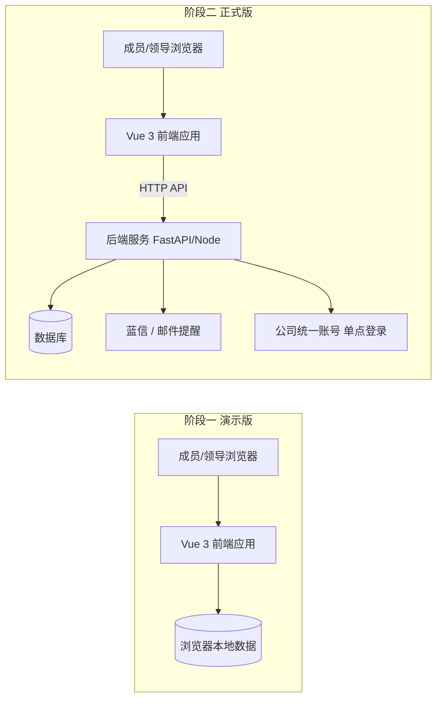

# 部门工作任务管理与进度看板 · 方案文档

> 版本：v0.7（讨论稿）｜日期：2026-09-11｜工作目录：`E:\Yxny_xcx`

## 1. 项目背景与目标

部门内 8–10 名成员需要在线更新各自的工作任务内容；领导希望通过一个总览看板直观掌握全部门任务进度，并能点击查看任务详情。

**核心目标**

1. 成员在线填报 / 更新任务（任务内容、任务来源、执行人、负责人、起止时间）
2. 任务进度以「周」为单位填报，保留历史变化
3. 汇总形成任务总览看板，供领导查看；点击看板条目可关联到任务内容

## 2. 用户角色

| 角色 | 说明 | 权限 |
| --- | --- | --- |
| 填报人（部门成员） | 8–10 人 | 新建/编辑本人任务；填报、修改本周进度；评论、上传附件；**不能修改历史周记录** |
| 领导 | 部门负责人 | 查看全部任务、看板与统计；导出报表；以只读为主，也可编辑任务；登录后默认进入总览看板 |
| 管理员 | 指定一人兼任 | 维护人员名单、任务来源等字典；**负责修改历史周记录、进度回退等更正操作** |

## 3. 功能需求

### 3.1 任务管理

| 字段 | 说明 |
| --- | --- |
| 任务内容 | 文本描述 |
| 任务来源 | 下拉选择：11 项固定来源（见下）＋ 支持成员自行添加新来源 |
| 执行人 | 从人员名单选择 |
| 负责人 | 从人员名单选择 |
| 起始时间 | 日期 |
| 终止时间 | 日期 |
| 优先级 | 紧急 / 高 / 中 / 低，用颜色区分（红 / 橙 / 黄 / 绿），列表与看板中显示为彩色标签 |
| 状态 | 未开始 / 进行中 / 已完成 / 已暂停（另自动判定「已逾期」） |

- 操作：新建、编辑、删除（软删除）、多条件查询筛选
- 「已逾期」自动判定：今天 > 终止时间 且状态 ≠ 已完成

**固定任务来源（11 项）**

集团公司、电网公司、政府部门、公司总办会、周生产例会、月度安全例会、季度安委会、生产经营分析会、公司专题会、分管领导交办、主管领导交办

> 成员也可自行添加新来源；新增来源进入来源字典供全员复用，管理员可维护（改名 / 停用）。

### 3.2 每周进度填报

- 以自然周为单位（周一至**不设填报截止时间**，成员可随时填报或修改本周记录
- **历史记录全部保留**，形成进度趋势；成员不能修改历史周记录、不能回退进度，如需更正须联系管理员账号操作13）」
- 每条周进度记录包含：
  - 进度百分比（0–100%）
  - 状态（未开始 / 进行中 / 已完成 / 已暂停）
  领导登录后**默认进入本页面**（直达看板）
- 默认展示全部未完成任务，支持筛选：执行人、负责人、状态、时间范围、任务来源、优先级
- 视图切换：卡片视图 / 表格视图 / 按人分组视图
- 优先级颜色标识：紧急（红）/ 高（橙）/ 中（黄）/ 低（绿）
- 自动预警：逾期标红、临近到期（默认 3
- 每个任务每周一条记录，可修改本周记录；**历史记录全部保留**，形成进度趋势
- 趋势展示：单任务各周进度折线图；部门整体完成率按周趋势

### 3.3 总览看板（领导视图）

- 默认展示全部未完成任务，支持筛选：执行人、负责人、状态、时间范围、任务来源
- 视图切换：卡片视图 / 表格视图 / 按人分组视图
- 自动预警：逾期标红、临近到期（N 天内）黄色提醒
- **点击看板条目 → 打开任务详情（关联任务内容、周进度时间线、评论、附件）**
- 顶部统计卡：任务总数、进行中、已完成、逾期数量

### 3.4 统计报表

- 每人任务数量与完成率
- 部门整体完成率趋势（按周）
- 任务来源分布
- 图表使用 ECharts，风格简洁，适合投屏汇报

### 3.5 数据导出

- 导出 Excel：任务清单（含最新进度）、周进度明细
- 演示版在前端直接生成 Excel，无需服务器

### 3.6 提醒机制

- **每周一 09:00 定时提醒**：向领导账号自动发送提醒；领导点开提醒后直接进入总览看板界面
  - 可选扩展：同时提醒成员填报本周进度
- 到期提醒：终止时间前 N 天，提醒执行人 / 负责人
- 逾期提醒：逾期未完成自动提醒 + 看板标红
- 推送渠道：可对接蓝信 / 邮件（依赖后端定时任务）
- 说明：纯前端演示版无法真实推送，界面内以模拟提醒 / 标红方式呈现

### 3.7 评论与附件

- 任务下可评论，形成协作记录
- 支持上传附件（任务相关文件）
- 任务列表与看板显示附件数量标识（📎 N）

### 3.8 文件传阅与阅读提醒（v0.6 新增）

- 领导 / 管理员下发文件：上传文件 + 事由说明 + 指定阅读人（可多选）+ 阅读时限
- 被指定人阅读后一键「标记已读」（记录阅读时间）；所有人可在线查看与下载
- 下发人可查看阅读情况（x/y 已读、未读人员名单），支持「一键提醒未读人员」
- 未读提醒入口：登录弹窗提醒、顶部铃铛红点、工作台「待阅读文件」区块
- 推送渠道：正式版通过蓝信 / 邮件推送未读提醒（依赖后端定时任务）；演示版为界面内模拟提示

### 3.9 看板大屏化与智能问答（v0.7 新增，领导演示反馈）

- **看板大屏化**：完成率环形图 + 六项 KPI 渐变横幅；任务状态分布、优先级分布、近 8 周新增 / 填报趋势三图表，适合投屏汇报
- **智能问答窗口**：输入自然语言问题（如「这个月开始的任务还有多少没有完成？」）→ 自动检索任务数据 → 输出结论 + 图表 + 明细，支持快捷提问与继续追问
  - 可识别：时间范围（本月 / 上月 / 指定月份如「7月」「去年7月」/ 本季度 / 今年 / 本周 / 上周 / 今天）、人员（姓名 / 职务）、任务来源、状态条件（未完成 / 已完成 / 逾期 / 临近截止），以及数量、明细、完成率、按人排行、近 8 周趋势等问法
  - 智能回退：「本月开始」无记录时自动改用「本月截止」检索并说明口径
  - 输入联想：输入过程中实时预测想问的问题（模糊匹配 + 命中高亮），点击即发起提问；词库按当前数据动态生成（月份 / 人员 / 来源）
  - 正式版方案：可替换为大模型（理解能力更强）+ 后端问答接口；演示版为前端本地规则解析，零依赖、可离线演示

## 4. 数据模型（初步设计）

| 表 | 主要字段 |
| --- | --- |
| users 用户 | id、姓名、部门、角色（成员/领导/管理员）、账号、状态 |
| tasks 任务 | id、任务内容、任务来源、执行人、负责人、起始时间、终止时间、状态、创建人、创建/更新时间 |
| task_progress 周进度 | id、任务 id、周次（如 2026-W37）、进度百分比、状态、本周进展、问题与风险、下周计划、填报人、填报时间 |
| task_documents 传阅文件 | id、标题、事由说明、文件名 / 大小 / 内容、下发人、指定阅读人、阅读时限、阅读记录（人 + 时间）、创建时间 |
| task_comments 评论 | id、任务 id、用户 id、内容、时间 |
| task_attachments 附件 | id、任务 id、文件名、大小、存储地址、上传人、上传时间 |
| dictionaries 字典 | 任务来源等下拉选项（固定 11 项 + 成员新增，管理员可维护） |
| operation_logs 操作日志（可选） | id、操作人、对象类型 / ID、操作内容、时间（记录管理员的历史修改 / 回退操作） |

## 5. 技术方案

### 5.1 技术选型

| 层 | 选型 | 理由 |
| --- | --- | --- |
| 前端 | Vue 3 + Vite + Element Plus + ECharts | 中文生态成熟，企业后台组件丰富；演示版与正式版复用同一套界面 |
| 状态 / 路由 | Pinia + Vue Router | Vue 官方推荐组合 |
| 阶段一数据 | 浏览器本地存储（localStorage / IndexedDB）+ 示例数据 | 零服务器成本，可完整演示全部交互 |
| 阶段二后端 | FastAPI（Python）或 Node.js；SQLite → 可平滑升级 MySQL/PostgreSQL | 10 人规模绰绰有余 |
| 部署 | 阶段一 GitHub Pages；阶段二 阿里云/腾讯云轻量服务器或公司内网机器 | 成本低、切换快 |

### 5.2 架构示意

（领导登录后直达看板） | 账号密码 → 公司统一账号 SSO |
| 提醒 | 看板标红预警 + 模拟提醒 | 每周一 09:00 领导提醒、到期 / 逾期提醒

| 能力 | 演示版（GitHub） | 正式版（云服务器） |
| --- | --- | --- |
| 数据存储 | 浏览器本地，可导出 / 导入 JSON 备份 | 服务器数据库，多人共享 |
| 登录 | 选择姓名进入 | 账号密码 → 公司统一账号 SSO |
| 提醒 | 看板标红预警 | 定时提醒推送 |
| 附件 | 浏览器本地临时存储 | 服务器文件存储 |
| 访问 | GitHub Pages 链接 | 云服务器 / 公司内网地址 |

### 5.4 备选方案说明
（登录后：成员 → 我的工作台；领导 → 总览看板）
如只求最快投入使用，飞书/钉钉多维表格、腾讯文档智能表格可零代码覆盖大部分需求；但看板样式、权限控制和后续 SSO 集成受平台限制。本项目按自研 Web 应用推进，灵活度最高。

## 6. 页面结构

1. **身份选择 / 登录页**
2. **我的工作台**：我的任务 + 本周待填报提醒
3. **任务列表页**：全部任务，多条件筛选
4. **任务详情页**：任务信息 + 周进度时间线 + 评论 + 附件
5. **周进度填报**（弹窗或独立页面）
6. **总览看板**（领导视图）：卡片 / 表格 / 按人分组
7. **统计报表**
8. **设置**（人员、任务来源字典）

## 7. 实施计划

| 里程碑 | 内容 | 预计工期 |
| --- | --- | --- |
| M1 演示版 | 前端全部功能 + 示例数据 + 部署 GitHub Pages | 2–3 个工作日 |
| M2 评审 | 向领导演示，收集修改意见并调整 | — |
| M3 正式版 | 后端 + 数据库 + 云服务器部署 + 账号登录 | 3–5 个工作日 |
| M4 集成 | 公司统一账号 SSO + 提醒推送 | 视 IT 部门配合情况 |

## 8. 风险与注意事项

1. **数据安全**：正式环境涉及部门真实工作数据，部署公有云前建议走公司信息安全审批；也可部署在公司内网机器。演示仓库只放示例数据，不放真实工作内容。
2. **GitHub 访问**：github.io 在国内访问可能不稳定；如领导打不开，可几分钟内切换部署到云服务器临时演示。
3. **SSO 对接**：公司统一账号账号关联需通过其开放平台申请应用凭证，并由 IT 部门配合，流程可能较长；前期先用独立账号，不影响使用。
4. **历史修改受控**：历史周记录修改 / 进度回退仅管理员可操作，界面已提示「联系管理员」。

## 9. 需求确认记录

### 9.1 已确认（2026-09-10）

- [x] **任务来源**：11 项固定来源 + 允许成员自行添加新来源
- [x] **新来源生效方式**：添加后即时可用，管理员可维护（不设审核）
- [x] **优先级**：四档，用颜色区分（紧急 / 高 / 中 / 低 → 红 / 橙 / 黄 / 绿）
- [x] **领导权限**：以只读为主，也可编辑任务
- [x] **填报要求**：不设截止时间；每周一 09:00 向领导账号自动提醒；领导打开后直接进入看板界面
- [x] **历史修改**：修改历史周记录、进度回退，需联系管理员账号操作

### 9.2 待再确认（不阻塞开发）

- [ ] 成员新增的任务来源：默认添加后即时可用（管理员可维护），是否需要改为「管理员审核后生效」
- [ ] 正式版提醒渠道：蓝信消息 / 邮件（需 IT 部门对接时确定）
- [ ] 领导账号是否需要编辑权限（还是纯只读）
- [ ] 每周填报截止时间（如周五下班前）
- [ ] 进度百分比是否允许回退 / 修改历史周记录

## 10. 变更记录

| 版本 | 日期 | 说明 |
| --- | --- | --- |
| v0.1 | 2026-09-10 | 初稿 |
| v0.2 | 2026-09-10 | 确认任务来源（固定 11 项，含计划 / 专项工作 / 客户需求 / 其他）、优先级颜色、领导权限、周一 09:00 提醒、历史修改规则；确认新增「优先级」字段 |
| v0.3 | 2026-09-10 | 优先级定为四档（紧急 / 高 / 中 / 低）；来源即时可用；演示版开发启动 |
| v0.4 | 2026-09-10 | 人员名单更新为 12 人（含主任 / 副主任 / 领导 / 管理员）；导入部门任务清单（68 项）；演示版完成并验证 |
| v0.5 | 2026-09-10 | 演示版完善：Excel 在线导入、逾期双标识、填报参考上周、排序 / 重点置顶、移动端适配 |
| v0.6 | 2026-09-10 | 新增文件传阅与阅读提醒（下发文件 / 指定阅读人 / 标记已读 / 未读提醒）；任务附件数量标识；修复文档结构问题 |
| v0.7 | 2026-09-11 | 看板大屏化（KPI 横幅 + 三图表）；新增智能问答（自然语言检索 + 图表输出 + 智能回退） |

---

*本文档将随讨论持续更新。*
